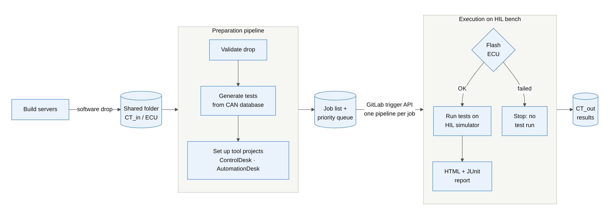
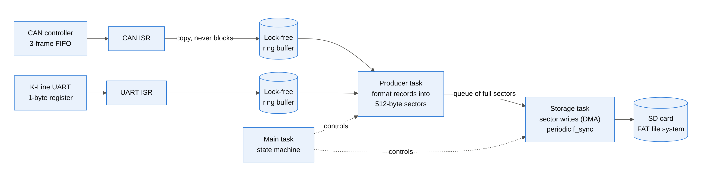
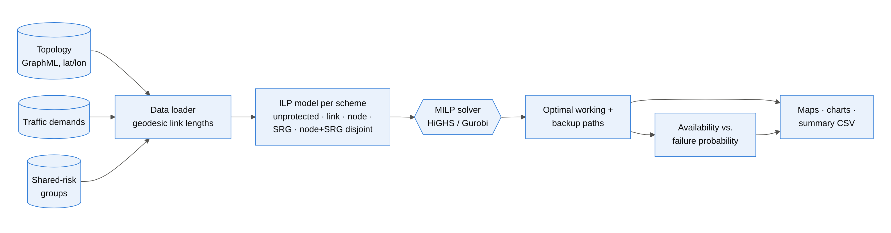
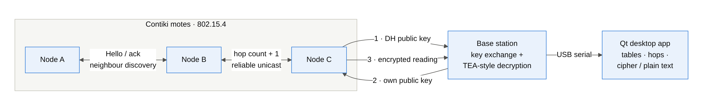
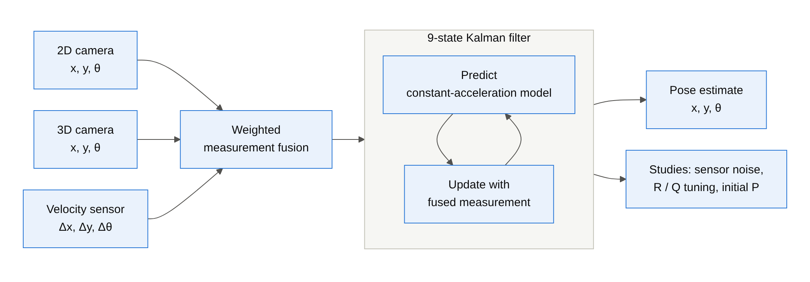

## Hi, I'm Prajwala Sudi 👋

**Automotive E/E systems engineer, Munich** · ~10 years in vehicle electronics, from
embedded software to HIL test automation and CI/CD for ECU validation.

- 🚗 Design Release Engineer on a **Level 4 autonomous-vehicle programme** 
- 🚚 Designed and built, a **GitLab CI/CD system that
  automates HIL testing** of truck ECU software across 18 ECU types: from a new software
  drop to flashed ECUs, executed test suites and reports, with no manual steps
- 🔧 Embedded and real-time software: FreeRTOS, Contiki, STM32 / Cortex-M, CAN, K-Line, UDS
- 🎓 M.Sc. Communications Engineering, **TU München** · iSAQB **CPSA** certified software architect (2022)
- 🤖 Currently building GenAI skills: RAG and agentic frameworks
- 🌍 English (fluent), German (B1), Hindi, Kannada

### Projects

#### [HIL Test Automation Pipeline](https://github.com/prajwalasudi-rgb/HIL-Test-Automation-Pipeline)

A multi-ECU CI/CD pipeline for hardware-in-the-loop testing. A new software drop in a shared folder triggers a preparation pipeline that validates it, generates test suites from the CAN database and sets up the ControlDesk/AutomationDesk projects; jobs then go through a priority queue to the HIL bench, where each ECU is flashed over UDS (a failed flash stops the run) before the tests execute and HTML/JUnit reports are written. An open re-implementation of the architecture of the production system I built for 18 ECU types.

Python · GitLab CI · CAN/J1939 · DBC · UDS

#### [RTOS Data Logger (CAN + K-Line)](https://github.com/prajwalasudi-rgb/RTOS-Data-Logger-CAN-KLine)

Why a sequential embedded logger loses most of its data and how a FreeRTOS producer/consumer design fixes it. Interrupt handlers only copy frames into lock-free ring buffers; a producer task packs them into 512-byte sectors and a storage task writes whole sectors to the SD card. Under load the sequential design logs 5–20 % of CAN frames, the RTOS design 100 %.

C · FreeRTOS · lock-free ring buffers · CAN · K-Line · SD/FAT

#### [Optical Network Resilience (ILP)](https://github.com/prajwalasudi-rgb/Optical-Network-Resilience-ILP)

Optimal protected routing in European, German and US backbone networks. Five protection schemes (unprotected, link-, node-, shared-risk- and node+SRG-disjoint) are formulated as integer linear programs and solved with HiGHS or Gurobi; the resulting working and backup paths are compared on cost and on availability under failures.

Python · ILP (PuLP / HiGHS, Gurobi) · NetworkX

#### [Secure Multi-Hop WSN](https://github.com/prajwalasudi-rgb/WSN-Secure-Multihop-Contiki)

Firmware for a wireless sensor network on Contiki: nodes discover their neighbours, build hop-count routes and forward readings by reliable unicast to a base station. Each node agrees a key with the base station by Diffie-Hellman and sends its readings encrypted; a Qt desktop app shows the nodes, hops and cipher/plain text over USB serial.

C · Contiki · IEEE 802.15.4 · Qt / C++

#### [Sensor Data Fusion](https://github.com/prajwalasudi-rgb/Sensor-Data-Fusion)

Master thesis (TU München): pose estimation by fusing 2D and 3D camera measurements and velocity data in a 9-state Kalman filter, with studies of sensor noise, filter tuning and initial conditions.

MATLAB · Kalman filtering · state estimation

### Skills

**Automotive:** HIL testing (dSPACE ControlDesk, AutomationDesk, ConfigurationDesk), CANalyzer/CANoe,
CAN/J1939, K-Line, UDS diagnostics and flashing, ECU integration and validation, autonomous driving programmes 
**Software:** Python, C, C++, MATLAB/Simulink · FreeRTOS, Contiki · CI/CD (GitLab CI, GitHub Actions) · Git, SVN 
**Architecture & methods:** software architecture (iSAQB CPSA), test automation frameworks, optimisation (ILP), state estimation
